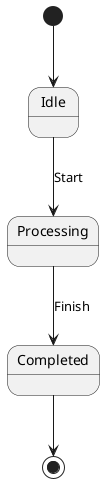
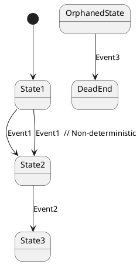

# State Machine Analysis Framework

The UPML-RS analysis framework provides comprehensive validation, metrics calculation, and reachability analysis for state machines. This framework helps identify potential issues, measure complexity, and understand the structure of your state machines.

## Features

### 1. Validation (`StateMachineValidator`)

The validator checks for common state machine design issues:

#### Error-level Issues
- **Missing Initial State**: State machine has no initial state
- **Unreachable States**: States that cannot be reached from initial states
- **Non-deterministic Transitions**: Multiple transitions from same state with same event

#### Warning-level Issues  
- **Multiple Initial States**: More than one initial state (may be intentional)
- **Orphaned States**: States with no incoming or outgoing transitions

#### Info-level Issues
- **Undefined Events**: Events used only once (possible typos)
- **Dead States**: States with no outgoing transitions that aren't marked as final

### 2. Complexity Metrics (`MetricsAnalyzer`)

Calculates various complexity metrics:

- **Cyclomatic Complexity**: Measures decision points (transitions - states + 2)
- **State Complexity**: Total number of states
- **Transition Complexity**: Total number of transitions  
- **Depth Complexity**: Maximum hierarchy depth
- **Fan-out/Fan-in**: Average number of outgoing/incoming transitions per state
- **Coupling Factor**: How interconnected states are (0-1 scale)
- **Cohesion Factor**: How well states work together (0-1 scale)

### 3. Reachability Analysis (`ReachabilityAnalyzer`)

Analyzes state connectivity and paths:

- **Reachable States**: All states reachable from initial states
- **Unreachable States**: States that cannot be reached
- **Shortest Paths**: Optimal paths between any two states
- **All Paths**: Multiple paths between states (limited to prevent explosion)
- **Strongly Connected Components**: Groups of mutually reachable states

## Usage

### Command Line Interface

```bash
# Analyze a state machine
cargo run -- --backend analyze --input my_state_machine.plantuml

# Analyze with output to file
cargo run -- --backend analyze --input input.plantuml --output analysis_report.txt
```

### Programmatic API

```rust
use upml_rs::{parse_plantuml, analysis::{StateMachineValidator, MetricsAnalyzer, ReachabilityAnalyzer}};

let state_machine = parse_plantuml(plantuml_content)?;

// Validation
let validator = StateMachineValidator::new();
let validation_report = validator.validate(&state_machine)?;

// Metrics
let metrics_analyzer = MetricsAnalyzer::new();
let complexity = metrics_analyzer.analyze_complexity(&state_machine)?;
let state_metrics = metrics_analyzer.analyze_states(&state_machine)?;

// Reachability
let reachability_analyzer = ReachabilityAnalyzer::new();
let reachability = reachability_analyzer.analyze(&state_machine)?;
let path_analysis = reachability_analyzer.find_path(&state_machine, "StateA", "StateB")?;
```

## Analysis Report Format

The analysis report includes:

1. **Basic Information**: State count, transition count, events, hierarchy depth
2. **Validation Results**: Error/warning/info counts with detailed issue descriptions
3. **Complexity Metrics**: All calculated complexity measures
4. **Reachability Analysis**: Reachable/unreachable states, strongly connected components
5. **State Analysis**: Individual state metrics for critical states
6. **Quality Score**: Overall quality rating (0-10) with recommendations

## Quality Scoring

The quality score is calculated based on:

- **Deductions for Issues**: 
  - Errors: -2.0 points each
  - Warnings: -0.5 points each
- **Complexity Penalties**:
  - High cyclomatic complexity (>10): -1.0 point
  - High coupling factor (>0.5): -1.0 point  
  - High fan-out (>3.0): -0.5 points
- **Bonuses**:
  - Good cohesion (>0.7): +0.5 points

Quality levels:
- 9-10: Excellent
- 7-8: Good
- 5-6: Fair
- 3-4: Poor
- 0-2: Needs Improvement

## Examples

### Simple State Machine Analysis



Results:
- ✅ No validation errors
- 📊 Low complexity (3 states, 3 transitions)
- 🎯 All states reachable
- 🎖️ Quality Score: 10/10 (Excellent)

### Complex State Machine with Issues



Results:
- ⚠️ Unreachable states: OrphanedState, DeadEnd
- ⚠️ Non-deterministic transition from State1
- 📊 Medium complexity
- 🎖️ Quality Score: 6.5/10 (Fair)

## Integration with Verification Tools

The analysis framework complements formal verification:

1. **Pre-verification Analysis**: Identify issues before running SPIN or TLA+
2. **Complexity Assessment**: Determine if model is suitable for verification
3. **Path Analysis**: Understand critical execution paths
4. **Quality Assurance**: Ensure model meets quality standards

## Best Practices

1. **Aim for Quality Score ≥ 8**: Indicates well-designed state machine
2. **Fix Errors First**: Address validation errors before warnings
3. **Monitor Complexity**: Keep cyclomatic complexity under 10
4. **Ensure Reachability**: All states should be reachable unless intentionally isolated
5. **Use Analysis Iteratively**: Run analysis after each design change

## Future Enhancements

Planned improvements:
- **Temporal Logic Patterns**: Detect common temporal patterns
- **Performance Metrics**: Estimate verification complexity
- **Refactoring Suggestions**: Automated improvement recommendations
- **Comparative Analysis**: Compare multiple design alternatives
- **Export Formats**: JSON, XML, CSV output for integration