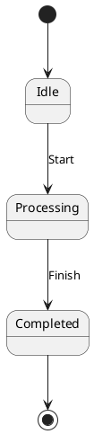
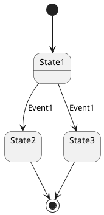
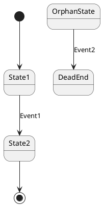

# NuSMV Backend for UPML-RS

The NuSMV backend generates symbolic model checking specifications from PlantUML state machines. NuSMV uses Binary Decision Diagrams (BDD) for efficient verification of temporal logic properties.

## Features

### 🎯 **Symbolic Model Checking**
- **Scalable verification**: Can handle models with 10^20+ states
- **Automatic BDD optimization**: No manual parameter tuning required
- **CTL and LTL support**: Comprehensive temporal logic coverage

### 🔧 **Generated Model Structure**
- **MODULE main**: Single module containing the state machine
- **VAR section**: State and event variables with enumerated types
- **ASSIGN section**: Initial state and transition logic
- **SPEC section**: Automatically generated temporal properties

### 📋 **Automatic Property Generation**

#### **Reachability Properties (EF)**
```smv
SPEC EF (state = StateX) -- StateX should be reachable
```
Generated for all non-initial states to verify model connectivity.

#### **Safety Properties (AG)**
```smv
SPEC AG (state = StateX -> EX TRUE) -- No deadlock from StateX
```
Generated for all non-final states to ensure no deadlocks.

#### **Liveness Properties (AF)**
```smv
SPEC AG (state = InitialState -> AF (state = FinalState))
```
Generated to ensure eventual reachability of final states.

## Usage

### Command Line Interface

```bash
# Generate NuSMV model
cargo run -- --backend nu-smv --input state_machine.plantuml --output model.smv

# Verify with NuSMV
NuSMV model.smv
```

### Programmatic API

```rust
use upml_rs::{parse_plantuml, generators::nusmv};
use std::fs::File;

let state_machine = parse_plantuml(plantuml_content)?;
let mut file = File::create("model.smv")?;
nusmv::generate_model(&mut file, &state_machine)?;
```

## Model Translation

### State Variables
```smv
VAR
  state : {State1, State2, State3};  -- All states as enumeration
  event : {Event1, Event2, Event3};  -- All events as enumeration
```

### Initial States
```smv
ASSIGN
  init(state) := InitialState;           -- Single initial state
  init(state) := {State1, State2};       -- Multiple initial states (non-deterministic)
```

### Transitions
```smv
next(state) := case
  state = From & event = Event : To;                    -- Simple transition
  state = From & event = Event & (guard) : To;          -- Transition with guard
  TRUE : state;                                         -- Default: stay in current state
esac;
```

### Final States
Transitions to `[*]` are converted to self-loops in the source state:
```plantuml
State1 --> [*] : Done
```
Becomes:
```smv
state = State1 & event = Done : State1;
```

## Verification Examples

### Example 1: Simple FSM


**Generated Properties:**
- `EF (state = Processing)` ✅ - Processing is reachable
- `EF (state = Completed)` ✅ - Completed is reachable  
- `AG (state = Idle -> EX TRUE)` ✅ - No deadlock from Idle
- `AG (state = Idle -> AF (state = Completed))` ✅ - Eventually reach final state

### Example 2: Non-deterministic FSM


**Generated Model:**
```smv
next(state) := case
  state = State1 & event = Event1 : State2;  -- First transition
  state = State1 & event = Event1 : State3;  -- Second transition (non-deterministic)
  TRUE : state;
esac;
```

**Verification:** NuSMV will explore both paths non-deterministically.

### Example 3: Unreachable States


**Verification Results:**
- `EF (state = OrphanState)` ❌ - OrphanState is unreachable
- `EF (state = DeadEnd)` ❌ - DeadEnd is unreachable

## Advanced Features

### Guards and Effects
```plantuml
State1 --> State2 : Event1 [x > 0] / x := x + 1
```

Generates:
```smv
state = State1 & event = Event1 & (x > 0) : State2;
```

Note: Effects are not modeled in the current implementation.

### Hierarchical States
Hierarchical states are flattened into a single state space:
```plantuml
state Outer {
  [*] --> Inner1
  Inner1 --> Inner2 : Event1
}
```

All substates become top-level states in the NuSMV model.

## Comparison with Other Backends

| Feature | SPIN | TLA+ | NuSMV |
|---------|------|------|-------|
| **State Space** | Explicit | Explicit | Symbolic |
| **Scalability** | Limited | Limited | High |
| **Temporal Logic** | LTL | TLA | CTL+LTL |
| **Counterexamples** | Execution traces | Execution traces | Execution traces |
| **Automation** | Manual setup | Manual setup | Automatic |

## Best Practices

### 1. **Use for Large Models**
NuSMV excels with complex state machines that would exhaust memory in SPIN or TLA+.

### 2. **Leverage Automatic Properties**
The generated properties catch common issues:
- Unreachable states
- Deadlocks
- Liveness violations

### 3. **Interpret Counterexamples**
When properties fail, NuSMV provides execution traces showing how to reach the problematic state.

### 4. **Combine with Analysis**
Use the analysis backend first to identify potential issues:
```bash
# First analyze
cargo run -- --backend analyze --input model.plantuml

# Then verify with NuSMV
cargo run -- --backend nu-smv --input model.plantuml --output model.smv
NuSMV model.smv
```

## Troubleshooting

### Common Issues

1. **Property Failures**
   - Check for unreachable states in your model
   - Verify that all states have outgoing transitions (except final states)
   - Ensure proper event handling

2. **Large State Spaces**
   - NuSMV handles large spaces well, but verification time may increase
   - Consider model abstraction for very complex systems

3. **Non-determinism**
   - Multiple transitions with same event are handled correctly
   - Use guards to make transitions deterministic if needed

### Performance Tips

1. **State Ordering**: NuSMV automatically optimizes BDD variable ordering
2. **Property Ordering**: Check simpler properties first
3. **Model Simplification**: Remove unnecessary states/events before verification

## Integration with CI/CD

```bash
#!/bin/bash
# Automated verification script

echo "Generating NuSMV model..."
cargo run -- --backend nu-smv --input $1 --output model.smv

echo "Running verification..."
if NuSMV model.smv | grep -q "is false"; then
    echo "❌ Verification failed - properties violated"
    exit 1
else
    echo "✅ Verification passed - all properties satisfied"
    exit 0
fi
```

## Future Enhancements

- **Custom Properties**: Support for user-defined CTL/LTL properties
- **Fairness Constraints**: Add fairness assumptions for liveness properties
- **Modular Models**: Support for multiple modules and composition
- **Optimization Hints**: Manual BDD variable ordering for performance tuning