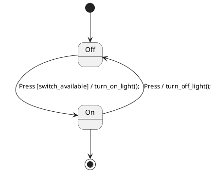

# UPML-RS: Formal Verification of UML State Machines

A Rust port of the original C++ upml tool for converting UML state machines (described in PlantUML) into formal verification models.

## Features

- **PlantUML Parser**: Parse UML state machine diagrams from PlantUML syntax with support for:
  - Composite states and hierarchical state machines
  - Parallel regions and concurrent states
  - Guards, effects, and state activities
  - Complex transition syntax
- **Multiple Verification Backends**:
  - **Promela/SPIN**: Generate Promela models for SPIN model checker (FSM & HSM)
  - **TLA+/PlusCal**: Generate TLA+/PlusCal models for formal verification
  - **NuSMV**: Generate symbolic models with CTL/LTL properties and fairness constraints
  - **Alloy**: Generate structural verification models with automatic assertions
- **Comprehensive Analysis**: Built-in validation, complexity metrics, and reachability analysis
- **Automated Verification**: Integrated verification runner that automatically:
  - Detects available verification tools (SPIN, TLA+, NuSMV, Alloy)
  - Generates appropriate models for each tool
  - Runs verification in parallel with optimal configurations
  - Provides unified reporting and counterexample extraction
- **Modern Rust**: Memory-safe implementation with excellent error handling
- **Fast Parsing**: Uses nom parser combinator library for efficient parsing

## Installation

### From Source

```bash
git clone <repository-url>
cd upml-rs
cargo build --release
```

The binary will be available at `target/release/upml`.

### Using Cargo

```bash
cargo install upml-rs
```

## Usage

### Basic Usage

```bash
# Parse from stdin, output to stdout
cat input.plantuml | upml --backend spin-fsm

# Parse from file, output to file
upml --input state_machine.plantuml --output model.pml --backend spin-fsm

# Generate TLA+ model
upml --input state_machine.plantuml --output model.tla --backend tla-fsm
```

### Backend Options

- `none`: Just parse and validate (no output generation)
- `spin-fsm`: Generate Promela FSM model for SPIN
- `spin-hsm`: Generate Promela HSM model for SPIN  
- `tla-fsm`: Generate TLA+/PlusCal model
- `nu-smv`: Generate NuSMV symbolic model with CTL/LTL properties and fairness constraints
- `alloy`: Generate Alloy structural verification model with automatic assertions
- `analyze`: Comprehensive state machine analysis and validation
- `verify`: **Automated verification** - detects available tools and runs verification automatically

### Automated Verification

The `verify` backend provides integrated verification across multiple tools:

```bash
# Automatic verification with all available tools
upml --input state_machine.plantuml --backend verify

# This will:
# 1. Detect available verification tools (SPIN, TLA+, NuSMV, Alloy)
# 2. Generate appropriate models for each tool
# 3. Run verification in parallel with optimal configurations
# 4. Provide unified reporting with counterexamples
# 5. Save detailed results to JSON file
```

**Supported Verification Tools:**
- **SPIN**: Model checking with Promela models
- **TLA+**: Temporal logic verification with TLC
- **NuSMV**: Symbolic model checking with CTL/LTL
- **Alloy**: Structural verification and constraint solving

**Features:**
- Automatic tool detection and configuration
- Parallel execution with timeout handling
- Optimal parameter selection based on model complexity
- Unified result reporting and counterexample extraction
- JSON export for integration with other tools

### Example

Input PlantUML file (`switch.plantuml`):



Generate Promela model:

```bash
upml --input switch.plantuml --output switch.pml --backend spin-fsm
```

Output (`switch.pml`):

```promela
/*
 * Generated Promela FSM model for state machine: Switch
 * Generated by upml-rs
 */

/* Message types (events) */
mtype = {
    EnterState,
    ExitState,
    NullEvent,
    Press
};

/* State enumeration */
mtype = {
    state_Off,
    state_On
};

/* Global variables */
mtype currentState;
chan eventQueue = [16] of { mtype };
bool inTransition = false;

/* Main FSM process */
active proctype StateMachine() {
    currentState = state_Off; 
    
    do
    :: eventQueue?event ->
        atomic {
            inTransition = true;
            
            /* State transitions */
            if
            :: (currentState == state_Off && event == Press) ->
                if
                :: (switch_available) ->
                    /* Effect: turn_on_light() */
                    currentState = state_On;
                :: else -> skip
                fi
            :: else -> skip
            fi
            
            inTransition = false;
        }
    od
}

/* LTL Properties */
ltl liveness { <>( currentState == state_On ) }
ltl safety { [](!inTransition -> <>inTransition) }
```

## Supported PlantUML Syntax

### Basic Elements

- **States**: `state StateName`
- **Transitions**: `State1 --> State2 : Event [guard] / effect;`
- **Initial/Final states**: `[*] --> State`, `State --> [*]`
- **Composite states**: `state Composite { ... }`

### Advanced Features

- **Guards**: `[condition]`
- **Effects**: `/ action1 \; action2 \;`
- **State activities**: `State: entry: action;`, `State: exit: action;`
- **Configuration**: `State: config: progressTag;`
- **Comments**: `// single line`, `/* multi-line */`

### Limitations

Current implementation has some limitations compared to the original C++ version:

- Simplified hierarchical state machine support
- Limited PlantUML syntax coverage
- Basic effect parsing

## Architecture

The Rust implementation follows a clean modular architecture:

```
src/
├── main.rs              # CLI interface
├── lib.rs               # Library root
├── ast/                 # Abstract Syntax Tree definitions
├── parser/              # PlantUML parser using nom
├── state_machine/       # State machine data structures
└── generators/          # Code generators (Promela, TLA+)
```

### Key Components

1. **Parser**: Uses nom parser combinators for robust PlantUML parsing
2. **AST**: Clean abstract syntax tree representation
3. **State Machine**: Rich data structures with builder pattern
4. **Generators**: Modular code generation for different backends

## Development

### Building

```bash
cargo build
```

### Testing

```bash
cargo test
```

### Linting

```bash
cargo clippy
cargo fmt
```

## Comparison with Original C++

| Feature | C++ Version | Rust Version |
|---------|-------------|--------------|
| Memory Safety | Manual | Automatic |
| Parser | Boost.Spirit | nom |
| CLI | Boost.Program_Options | clap |
| Error Handling | Exceptions | Result<T, E> |
| Build System | Make | Cargo |
| Dependencies | Boost | Pure Rust crates |

## Contributing

1. Fork the repository
2. Create a feature branch
3. Add tests for new functionality
4. Ensure all tests pass
5. Submit a pull request

## License

GPL-3.0-or-later (same as original C++ version)

## Related Tools

- [Original upml (C++)](https://github.com/original-repo)
- [SPIN Model Checker](https://spinroot.com/)
- [TLA+](https://lamport.azurewebsites.net/tla/tla.html)
- [PlantUML](https://plantuml.com/)